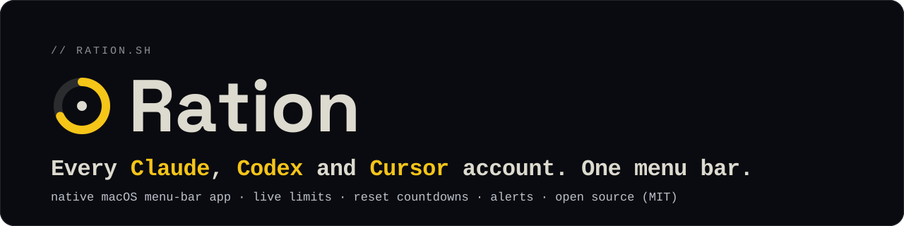

<p align="center">
  <a href="https://ration.sh"></a>
</p>

<p align="center">
  <a href="https://github.com/IZZY-Agency/ration/actions/workflows/ci.yml"></a>
  <a href="https://github.com/IZZY-Agency/ration/releases/latest"></a>
  <a href="https://github.com/IZZY-Agency/homebrew-tap"></a>
  <a href="LICENSE"></a>
</p>

# Ration

Know your Claude, Codex and Cursor limits before you hit the wall.

Ration is a native macOS menu-bar app that shows how much of each AI
subscription's window you have used, when it resets, and warns you before
you are blocked. It reads the same usage numbers each provider's own site
shows, from your own signed-in session, on your Mac.

[Website](https://ration.sh) ·
[Releases](https://github.com/IZZY-Agency/ration/releases) ·
[Issues](https://github.com/IZZY-Agency/ration/issues)

## What it does

- **Live meters per window.** Claude 5-hour, weekly and Fable weekly (Max
  plans); ChatGPT / Codex 5-hour and weekly; Cursor's usage-based spend for the
  current billing period.
- **Rings in the menu bar.** One ring per account, filled in the provider's
  colour, with a green dot on the account you are using right now.
- **Reset countdowns**, and a soonest-reset summary at the top of the popover.
- **Alerts at your thresholds.** A warning and a critical percentage per
  window, dollar thresholds for Cursor. Each crossing goes to a notification,
  to a small panel that drops from the menu bar, or both. It fires once per
  crossing and re-arms when the window resets. Privacy mode keeps account
  labels and exact usage out of notifications.
- **Usage-limit resets.** The free resets Claude and Codex give you, with
  their expiry, on each account card. An alert when one arrives and again a
  set number of days before it expires. Ration only shows them: you use them
  on the provider's own page.
- **History.** Daily burn for one account or all of them overlaid, an
  hour-of-day heatmap, and a burn-rate projection.
- **Billing-cycle utilisation.** How much of the plan you used since your
  renewal day, reported as a lower bound over the hours Ration actually
  watched.
- **Several accounts per provider**, grouped, with pause and resume that keeps
  the sign-in, and optional sorting by soonest reset.
- **Claude warm-up.** Start the 5-hour window the moment it resets, except
  during the hours and holidays you mark quiet, and never when the weekly
  allowance is already spent. On by default for newly added Claude accounts;
  switch it off per account.
- **Which account next.** When the account you're using nears its limit and
  another account on the same provider has clearly more room, Ration names it
  in the popover, the notification and the alerts panel, comparing real plan
  capacity (Pro, Max 5x/20x, Plus, Pro 5x/20x), not just percentages.
- **Focus layout.** One big number for the subscription you're using, what's
  nearly spent, and where to go next; switch from the popover header.
- **Feature switches.** Resets, switch suggestions, Claude warm-up and in-use
  detection can each be turned off in Settings.
- **English, French and Ukrainian.** Follows your macOS language, or pick one
  in Settings → General → Language.
- **Light or dark.** Follows macOS, or pick Light or Dark in Settings. Every
  text colour meets WCAG AA contrast in both, and Increase Contrast and
  VoiceOver are supported.

## Privacy

Ration has no server, no telemetry and no account of its own.

You sign in on the provider's own page inside the app. Each account gets its
own isolated WebKit data store, and Ration reads the usage endpoints that the
provider's usage page itself calls. Everything it keeps lives in the app's
sandbox container at `~/Library/Containers/agency.izzy.ration/` and never
leaves your Mac. Removing an account deletes its data store.

## Install

Requires macOS 26 or newer. Universal binary for Apple silicon and Intel,
signed with a Developer ID and notarized.

Either download the `.dmg` from the
[latest release](https://github.com/IZZY-Agency/ration/releases/latest), drag
Ration to Applications and open it, or use Homebrew:

```sh
brew install --cask izzy-agency/tap/ration
```

The cask lives in [IZZY-Agency/homebrew-tap](https://github.com/IZZY-Agency/homebrew-tap)
and installs the same signed, notarized build; `brew upgrade` keeps it current.

Ration lives in the menu bar; there is no Dock icon. Press ⌥⌘U to open its
window from anywhere, and ⌘, for Settings. With the popover open, ⌘R
refreshes, ⌘D dismisses the alerts panel and ⌘Q quits.

## Build from source

You need Xcode 26.6 or newer and [xcodegen](https://github.com/yonaskolb/XcodeGen).

```sh
make build       # generates Ration.xcodeproj with xcodegen, then builds
make unit-test   # runs the unit tests
```

`make release` produces the shippable app, but it needs the IZZY.Agency
Developer ID identity and notarization credentials, so it only works for the
maintainers.

## How this repository is maintained

Ration is developed in a private repository. Each release is published here as
a single commit tagged with its version, so this tree always matches the
shipped build. Bug reports and feature requests go in
[Issues](https://github.com/IZZY-Agency/ration/issues). Pull requests are
welcome: accepted changes are applied to the private tree and credited here in
the changelog.

## License

[MIT](LICENSE). The bundled typefaces Space Grotesk and Space Mono are licensed
under the SIL Open Font License 1.1; their license texts ship next to the font
files in `Ration/Resources/Fonts/`.
